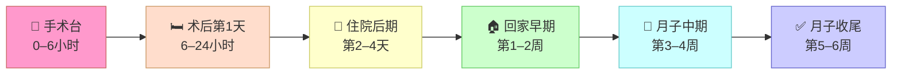

---
{"dg-publish":true,"permalink":"/好孕🌈/产后恢复/剖宫产后恢复全指南/","tags":["好孕","分娩","产后恢复","剖宫产","月子"]}
---


# 剖宫产后恢复全指南

> [!caution] 重要声明
> 本文提供的是通用性科普知识，**不能替代主治医生的具体医嘱**。
> 每位产妇的身体状况不同，请务必遵从你的医疗团队给出的个性化指导。
> **任何异常症状请立即告知医护人员或就诊。**

---

## 📑 目录

- [[好孕🌈/产后恢复/剖宫产后恢复全指南#🗺️ 恢复路线总览\|#🗺️ 恢复路线总览]]
- [[好孕🌈/产后恢复/剖宫产后恢复全指南#阶段一：手术台及麻醉苏醒期（术后 0–6 小时）\|#阶段一：手术台及麻醉苏醒期（术后 0–6 小时）]]
    - [[好孕🌈/产后恢复/剖宫产后恢复全指南#🩺 体位：必须平卧\|#🩺 体位：必须平卧]]
    - [[好孕🌈/产后恢复/剖宫产后恢复全指南#💧 禁食禁水：6 小时内\|#💧 禁食禁水：6 小时内]]
    - [[好孕🌈/产后恢复/剖宫产后恢复全指南#🩸 三件事同时进行\|#🩸 三件事同时进行]]
    - [[好孕🌈/产后恢复/剖宫产后恢复全指南#😴 观察 & 报警信号\|#😴 观察 & 报警信号]]
- [[好孕🌈/产后恢复/剖宫产后恢复全指南#阶段二：术后第 1 天（6–24 小时）\|#阶段二：术后第 1 天（6–24 小时）]]
    - [[好孕🌈/产后恢复/剖宫产后恢复全指南#💨 排气（放屁）：肠道复活的信号\|#💨 排气（放屁）：肠道复活的信号]]
    - [[好孕🌈/产后恢复/剖宫产后恢复全指南#🚶 首次下床：越早越好，但要有人扶\|#🚶 首次下床：越早越好，但要有人扶]]
    - [[好孕🌈/产后恢复/剖宫产后恢复全指南#🧤 弹力袜：穿上别脱\|#🧤 弹力袜：穿上别脱]]
    - [[好孕🌈/产后恢复/剖宫产后恢复全指南#💊 疼痛管理：别硬撑\|#💊 疼痛管理：别硬撑]]
- [[好孕🌈/产后恢复/剖宫产后恢复全指南#阶段三：住院后期（术后第 2–4 天）\|#阶段三：住院后期（术后第 2–4 天）]]
    - [[好孕🌈/产后恢复/剖宫产后恢复全指南#🍚 饮食：三步递进\|#🍚 饮食：三步递进]]
    - [[好孕🌈/产后恢复/剖宫产后恢复全指南#🩹 伤口观察：每天检查\|#🩹 伤口观察：每天检查]]
    - [[好孕🌈/产后恢复/剖宫产后恢复全指南#🩸 恶露：正常变化规律\|#🩸 恶露：正常变化规律]]
    - [[好孕🌈/产后恢复/剖宫产后恢复全指南#🤱 哺乳：越早开始越好\|#🤱 哺乳：越早开始越好]]
- [[好孕🌈/产后恢复/剖宫产后恢复全指南#阶段四：出院回家早期（第 1–2 周）\|#阶段四：出院回家早期（第 1–2 周）]]
    - [[好孕🌈/产后恢复/剖宫产后恢复全指南#🏠 居家伤口护理\|#🏠 居家伤口护理]]
    - [[好孕🌈/产后恢复/剖宫产后恢复全指南#🚿 洗澡：三个阶段，循序渐进\|#🚿 洗澡：三个阶段，循序渐进]]
    - [[好孕🌈/产后恢复/剖宫产后恢复全指南#🚫 第 1–2 周活动禁忌\|#🚫 第 1–2 周活动禁忌]]
    - [[好孕🌈/产后恢复/剖宫产后恢复全指南#🚽 排便：头等大事\|#🚽 排便：头等大事]]
    - [[好孕🌈/产后恢复/剖宫产后恢复全指南#🧠 情绪：产后第 2–4 天是"哭点"\|#🧠 情绪：产后第 2–4 天是"哭点"]]
- [[好孕🌈/产后恢复/剖宫产后恢复全指南#阶段五：月子中期（第 3–4 周）\|#阶段五：月子中期（第 3–4 周）]]
    - [[好孕🌈/产后恢复/剖宫产后恢复全指南#😴 作息：睡眠比任何补品都重要\|#😴 作息：睡眠比任何补品都重要]]
    - [[好孕🌈/产后恢复/剖宫产后恢复全指南#🍲 饮食进阶\|#🍲 饮食进阶]]
    - [[好孕🌈/产后恢复/剖宫产后恢复全指南#🩹 伤口进入"痒痒期"\|#🩹 伤口进入"痒痒期"]]
    - [[好孕🌈/产后恢复/剖宫产后恢复全指南#🧘 适度动起来\|#🧘 适度动起来]]
- [[好孕🌈/产后恢复/剖宫产后恢复全指南#阶段六：月子收尾与产后复查（第 5–6 周）\|#阶段六：月子收尾与产后复查（第 5–6 周）]]
    - [[好孕🌈/产后恢复/剖宫产后恢复全指南#🏥 产后 42 天检查：必须做！\|#🏥 产后 42 天检查：必须做！]]
    - [[好孕🌈/产后恢复/剖宫产后恢复全指南#💑 恢复性生活：别急\|#💑 恢复性生活：别急]]
    - [[好孕🌈/产后恢复/剖宫产后恢复全指南#🏃 运动恢复：循序渐进\|#🏃 运动恢复：循序渐进]]
- [[好孕🌈/产后恢复/剖宫产后恢复全指南#📋 快速参考卡：各阶段核心任务\|#📋 快速参考卡：各阶段核心任务]]
- [[好孕🌈/产后恢复/剖宫产后恢复全指南#🆘 出现这些症状，立即就诊（不要等！）\|#🆘 出现这些症状，立即就诊（不要等！）]]
- [[好孕🌈/产后恢复/剖宫产后恢复全指南#🔗 相关笔记\|#🔗 相关笔记]]

---

## 🗺️ 恢复路线总览



---

## 阶段一：手术台及麻醉苏醒期（术后 0–6 小时）

> [!info] 这个阶段你在做什么？
> 手术结束后，你会被推入苏醒室或直接回病房，由护士密切监测生命体征。你的主要任务是**配合医护，不要乱动**。

### 🩺 体位：必须平卧

| 要求 | 原因 |
| :--- | :--- |
| **去枕平卧 6 小时** | 腰麻/硬膜外麻醉后，过早抬头可能引发剧烈头痛（麻醉液体压力变化） |
| 头偏向一侧 | 防止呕吐时误吸（恶心呕吐是麻醉常见反应） |

### 💧 禁食禁水：6 小时内

- 肠道在麻醉下暂停蠕动，进食会引发呕吐和吸入性肺炎
- 排气后才能逐步开始饮水和进食（见阶段二）

### 🩸 三件事同时进行

| 护理项目 | 你的感受 | 为什么做 |
| :--- | :--- | :--- |
| **留置导尿管** | 下腹部有轻微异物感 | 手术中及术后早期无法自主排尿，保护膀胱 |
| **输液（含缩宫素）** | 肚子阵阵发紧/发硬 | 缩宫素帮助子宫收缩止血，是术后必须经历的 |
| **按压宫底** | ==非常痛！== 这是很多妈妈的噩梦 | 护士定时按压，排出宫腔积血，预防产后大出血 |

> [!warning] 关于"按压肚子"的疼痛
> 按压宫底的疼痛是剖宫产恢复中公认最难熬的部分之一。
> **应对方法**：提前向医生申请"双氯芬酸钠栓"等镇痛药物塞肛（[[好孕🌈/待产包/清单#神药\|神药备注]]），按压前告知护士使用，可显著减轻疼痛。

### 😴 观察 & 报警信号

如果出现以下情况，**立即呼叫护士**：
- 💨 呼吸困难、胸闷
- 🥶 发冷发抖持续不退
- 🩸 阴道出血量突然增多（湿透一片护垫不到1小时）
- 🤢 持续呕吐无法停止

---

## 阶段二：术后第 1 天（6–24 小时）

> [!tip] 这一天的核心任务
> **排气 + 首次下床**，这两件事完成得越及时，后续恢复越顺利。

### 💨 排气（放屁）：肠道复活的信号

- 剖宫产手术会刺激肠道，导致肠蠕动暂时停止
- **排气前**：只能喝少量温水（30–50ml 试饮）
- **排气后**：可以开始正式进食流食（米汤、藕粉、稀粥）
- **帮助排气的方法**：轻柔顺时针按摩腹部、翻身变换体位、尽早下床走动

> [!warning] 排气前禁止喝牛奶、豆浆、甜饮料
> 这些会加重腹胀，非常不舒服。第一口食物：==温水或清淡米汤==。

### 🚶 首次下床：越早越好，但要有人扶

**为什么这么重要？**
- 预防深静脉血栓（DVT）——剖宫产是血栓高危手术
- 促进肠蠕动，加速排气
- 帮助子宫复旧，减少宫腔积血

**首次下床步骤（必须有家属在旁）：**

```
1. 床头摇高，坐起来 → 稍坐片刻，确认不头晕
2. 双腿垂在床边 → 再等一会儿
3. 家属搀扶，缓慢站起 → 站稳后再迈步
4. 在床边走几步即可，量力而行
```

> [!danger] 下床注意
> - 起身时**用手臂撑起上半身**，不要直接仰卧猛坐起（牵拉腹部伤口剧痛！）
> - 初次下床可能头晕，**家属全程不能离开**
> - 感觉伤口疼痛是正常的，可以用手或束腹带稍微托住腹部

### 🧤 弹力袜：穿上别脱

- 择期剖宫产入院前已测量尺寸购入（见[[好孕🌈/待产包/清单\|清单]]）
- 术后持续穿着，直到可以正常走动、医生允许停用
- 作用：压迫下肢静脉，防止血栓形成

### 💊 疼痛管理：别硬撑

| 药物类型 | 用法 | 适合时机 |
| :--- | :--- | :--- |
| **双氯芬酸钠栓**（塞肛） | 遵医嘱使用 | 按压宫底前、疼痛明显时 |
| **静脉镇痛泵**（部分医院） | 按压按钮自控 | 持续镇痛 |
| **口服止痛药** | 医生开具后按时服 | 出院后早期 |

> [!tip] 主动要止痛药是正确的
> 疼痛控制好 = 你才能放松、才能早下床、才能好好喂奶。
> 忍痛并不高尚，**告诉医护你的疼痛程度（0–10分），主动要求镇痛**。

---

## 阶段三：住院后期（术后第 2–4 天）

### 🍚 饮食：三步递进

| 时间节点 | 饮食阶段 | 允许的食物 | 禁忌 |
| :--- | :--- | :--- | :--- |
| 排气前 | 禁食，少量温水 | 温水（30–50ml/次） | 一切食物 |
| 排气后当天 | 流食 | 米汤、藕粉、稀粥、蛋花汤 | 牛奶、豆浆、产汤 |
| 术后第2天起 | 半流食→软食 | 面条、蒸蛋、软烂米饭 | 油腻、辛辣、胀气食物 |
| 术后第4天+ | 普通饮食过渡 | 正常食物，清淡为主 | 过于油腻的催奶汤 |

> [!warning] 月子汤要等一等！
> 剖宫产后**至少一周内**不要喝浓郁的猪脚汤、鲫鱼汤等。
> 此时乳腺管尚未完全通畅，高脂肪的汤水极易造成**堵奶、乳腺炎**。
> 第一周：清淡为主；第二周后：可以开始喝淡汤。

### 🩹 伤口观察：每天检查

**正常现象：**
- 伤口周围轻微发红、肿胀（炎症反应，正常）
- 轻微瘙痒（愈合信号）
- 伤口边缘轻压有疼痛

**需要告知医生的情况：**
- 🔴 伤口裂开、有渗液/脓性分泌物
- 🔴 伤口周围皮肤发烫、发硬范围扩大
- 🔴 持续高烧（体温 > 38.5°C）

### 🩸 恶露：正常变化规律

| 时间 | 颜色 | 正常量 |
| :--- | :--- | :--- |
| 术后 1–4 天 | 鲜红色（血性恶露） | 量较多，类似月经量 |
| 第 1–2 周 | 淡红→粉褐色（浆液性恶露） | 量逐渐减少 |
| 第 3–4 周 | 白色/淡黄色（白色恶露） | 量少，逐渐停止 |

> [!danger] 恶露异常警报
> - 鲜红恶露持续超过2周不减少
> - 恶露有异味（可能宫腔感染）
> - 恶露突然增多、有血块
> → 以上情况需立即就诊！

### 🤱 哺乳：越早开始越好

#### ⏰ 何时开始？

> [!tip] 核心原则：**越早越好，不必等到奶来了再喂**
> 剖宫产后，只要妈妈意识清醒、生命体征稳定，就可以开始尝试哺乳。
> 宝宝的吸吮是启动泌乳的最强信号，等奶来了再喂，反而会让泌乳更晚。

| 时间窗口 | 目标 | 说明 |
| :--- | :--- | :--- |
| **术后 1–2 小时内** | 皮肤接触（Skin-to-skin） | 在手术台或苏醒室，让宝宝趴在妈妈胸口，感受体温和心跳，刺激催产素分泌 |
| **术后 2–4 小时** | 第一次吸吮乳头 | 回到病房后，体力稍有恢复即可尝试；宝宝含住乳头的动作本身就是开奶 |
| **此后按需哺乳** | 频繁、不限次 | 24小时内至少喂 8–12 次，不要等宝宝哭了才喂 |

> [!info] 剖宫产妈妈泌乳为何会晚一些？
> 顺产时，产道挤压和激素的自然激增会迅速触发泌乳。剖宫产绕过了这一过程，加之手术应激和卧床限制，泌乳启动通常比顺产晚 **1–2 天**（顺产约产后2天，剖宫产约产后3–4天）。
> **这完全正常**，且可通过频繁吸吮来加速。

#### 🍼 关于初乳

- 产后前几天乳汁量极少、颜色发黄——这是**初乳**，营养密度极高，不是"没奶"
- 新生儿第一天的胃只有**玻璃珠大小（5–7ml）**，初乳的量已经足够
- **不要因为奶少就急着加奶粉**：奶粉会降低宝宝的吸吮频率，反而让奶越来越少

#### 🧘 剖宫产专用喂奶姿势

剖宫产后腹部有伤口，普通摇篮式抱法会让宝宝压在伤口上，**痛感强烈且不安全**。

| 姿势 | 适合场景 | 操作要点 |
| :--- | :--- | :--- |
| **橄榄球式（侧抱式）** ⭐ 首选 | 住院及回家早期 | 宝宝夹在妈妈腋下，头朝乳房、身体朝后，像抱橄榄球一样；宝宝完全不接触腹部 |
| **侧躺式** | 夜间哺乳 / 疼痛明显时 | 妈妈侧卧，宝宝面对妈妈侧躺，腹部不受力；注意哺乳后让宝宝移回安全位置，避免同床 |
| **半躺式（生物养育法）** | 泌乳稳定后 | 妈妈斜靠床头（约 45°），宝宝趴在胸前，利用重力自然含乳；适合奶阵强的妈妈 |

> [!warning] 橄榄球式的操作细节
> - 妈妈坐起，用哺乳枕托住宝宝身体（减少手臂疲劳）
> - 宝宝的**耳朵、肩膀、臀部**呈一条直线，颈部不要扭曲
> - 用手掌托住宝宝后脑勺（不是推头部），让宝宝主动含乳
> - 含乳标准：宝宝嘴张大如打哈欠，下巴贴紧乳房，下嘴唇外翻（详见[[好孕🌈/待产包/（待确定）哺乳开奶#正确的衔乳姿势\|（待确定）哺乳开奶#正确的衔乳姿势]]）

#### ⚠️ 剖宫产哺乳特别注意事项

| 注意点 | 说明 |
| :--- | :--- |
| **导管和输液不是障碍** | 手上有留置针不影响喂奶，请家属帮忙固定好管路即可 |
| **疼痛会抑制喷乳反射** | 术后积极镇痛不只为了舒适，也直接有利于泌乳；喂奶前可在医嘱下使用止痛药 |
| **别等宝宝大哭再喂** | 哭是饥饿的最后信号，此时宝宝已过度焦躁，含乳更困难；出现觅食反射（转头、吐舌）就可以喂了 |
| **涨奶前不要热敷乳房** | 乳腺管未通时热敷会加重肿胀，只在喂奶前3–5分钟局部温敷以促进奶阵；疼痛时冷敷（详见[[好孕🌈/待产包/（待确定）哺乳开奶#生理性涨奶\|（待确定）哺乳开奶#生理性涨奶]]） |
| **麻醉药对母乳影响极微** | 硬膜外/腰麻药物浓度极低，进入乳汁的量可忽略不计，**不需要因为打了麻醉就停止哺乳** |

> [!success] 记住这句话
> **"奶不是等来的，是吸出来的。"**
> 剖宫产后泌乳启动慢，唯一的加速器就是——让宝宝多吸、勤吸。
> 每一次吸吮，都在告诉身体："我需要更多奶！"

---

## 阶段四：出院回家早期（第 1–2 周）

> [!info] 出院标准
> 通常术后 3–5 天，满足以下条件可以出院：
> ✅ 体温正常 ✅ 已正常排气排便 ✅ 伤口无感染征象 ✅ 可以自行下床行走

### 🏠 居家伤口护理

| 护理项目 | 操作方法 |
| :--- | :--- |
| **保持干燥** | 淋浴（不能盆浴），洗完立即用干净毛巾轻按吸干 |
| **束腹带** | 日常活动时穿戴，躺下休息可以放松；咳嗽、起身时必须穿 |
| **减张贴** | 伤口愈合后（约2–4周）开始使用，持续3–6个月，减少瘢痕增生 |
| **防晒** | 伤口愈合后避免阳光直射，减少色素沉着 |

> [!tip] 束腹带怎么穿才对？
> - 位置：托住小腹，覆盖伤口
> - 松紧：能放入一根手指的松紧度
> - 时机：活动和哺乳时穿，睡觉可以解开，不要24小时绑死

### 🚿 洗澡：三个阶段，循序渐进

| 阶段 | 时间 | 方式 | 条件 |
| :--- | :--- | :--- | :--- |
| **擦浴** | 术后第 2–3 天起（住院期间即可） | 温热毛巾擦拭身体 | 避开伤口区域 |
| **淋浴** | 术后 **7–14 天**，伤口愈合后 | 站立淋浴，不能泡水 | 见下方条件清单 ✅ |
| **盆浴/泡澡** | **产后 42 天检查通过后** | 盆浴、浴缸、温泉均可 | 宫颈口完全闭合，感染风险消除 |

**淋浴前，需同时满足以下条件：**
- ✅ 伤口已拆线或免拆线胶条自然脱落
- ✅ 伤口表面完全闭合，无渗液、无裂口
- ✅ 体力允许站立 5–10 分钟
- ✅ **出院时医生已明确告知可以淋浴**（直接问你的主治医生，比任何通用建议都准确）

> [!warning] 盆浴前请务必等到42天
> 产后宫颈口尚未完全闭合，盆浴时水中细菌极易上行进入宫腔，引发**子宫内膜炎**。
> 这条禁忌不分顺产剖宫产，同样适用。

**淋浴注意事项：**

| 要点 | 说明 |
| :--- | :--- |
| **时间要短** | 5–10 分钟以内，防止体力消耗过大或头晕 |
| **水温适中** | 38–40°C，不要过烫（高温影响伤口血液循环） |
| **洗完即干** | 立即用干净毛巾轻按吸干，再用纱布或防水敷贴保护伤口 |
| **必须有人在旁** | 月子早期头晕风险高，不要一个人锁门洗澡 |
| **洗完即暖** | 立刻穿上衣服，避免着凉 |

### 🚫 第 1–2 周活动禁忌

- ❌ 不提重物（超过宝宝体重即算重物）
- ❌ 不做家务（拖地、洗碗等弯腰动作）
- ❌ 不爬楼梯（必须爬时：扶着扶手，慢慢来）
- ❌ 不做核心力量动作（仰卧起坐等）
- ✅ 每天室内缓慢散步，逐渐增加时长

### 🚽 排便：头等大事

剖宫产后的**第一次大便**往往是让妈妈们最担心的事！

| 问题 | 解决方法 |
| :--- | :--- |
| 不敢用力，怕伤口裂 | 弯腰抱一个枕头顶住伤口，减少腹压 |
| 大便干燥 | 多喝水、吃蔬菜、蜂蜜水（[[好孕🌈/待产包/清单#蜂蜜露\|蜂蜜露]]）、必要时用开塞露 |
| 一直不排便 | 超过3天未排便，告知医生，可能需要使用药物辅助 |

### 🧠 情绪：产后第 2–4 天是"哭点"

- 激素在产后急剧下降，约 50–80% 的妈妈都会经历几天情绪波动（"baby blues"）
- 表现：莫名哭泣、烦躁、觉得自己做不好妈妈
- 这是**正常的生理反应**，通常 1–2 周内自然好转

> [!warning] 但如果出现以下情况，请寻求专业帮助
> - 情绪低落持续超过 **2 周**
> - 对宝宝没有感情，甚至产生伤害念头
> - 完全无法入睡、食欲全无
> → 这可能是**产后抑郁**，需要心理科就诊，和感冒一样需要治疗，不是"矫情"。

---

## 阶段五：月子中期（第 3–4 周）

### 😴 作息：睡眠比任何补品都重要

- **与宝宝同步睡眠**：宝宝睡你就睡，不要趁宝宝睡觉去刷手机
- 夜间哺乳：与家人轮班，每次连续睡眠不少于3小时
- 白天：尽量保证 1–2 次小睡

### 🍲 饮食进阶

| 原则 | 细节 |
| :--- | :--- |
| **催奶汤可以喝了** | 第2–3周起，鲫鱼汤、猪蹄汤去油喝清汤 |
| **补铁** | 动物肝脏、红肉，纠正手术中的失血 |
| **高蛋白促愈合** | 鸡蛋、瘦肉、鱼、豆腐，帮助伤口组织修复 |
| **高钙** | 牛奶、豆制品（哺乳会消耗大量钙质） |
| **别节食** | 月子里不是减肥的时候，营养影响乳汁质量 |

> [!tip] 月子饮食"三不要"
> 1. 不要过分忌口（蔬菜水果正常吃，避免便秘）
> 2. 不要过分进补（人参、浓汤过量反而上火、堵奶）
> 3. 不要喝酒（包括"月子酒"——酒精会通过母乳影响宝宝）

### 🩹 伤口进入"痒痒期"

- 第 2–4 周是瘢痕增生活跃期，**奇痒无比**是正常的
- ✅ 正确处理：轻轻拍打，或用减张贴/硅酮凝胶
- ❌ 错误处理：抓挠、撕除结痂
- 此时开始使用减张贴（如仙乐敷、美皮护），连续贴 3–6 个月效果最佳

### 🧘 适度动起来

- 可以在室外短距离散步（天气好、穿好衣服）
- **凯格尔运动**：随时可以做，无论顺产剖宫产，都需要锻炼盆底肌
- 不可以：跑步、跳绳、仰卧起坐等高强度运动

> [!example] 凯格尔运动怎么做
> 想象你正在憋尿 → 收缩盆底肌肉 → 保持 3–5 秒 → 放松
> 每次做 10–15 个 × 3 组，每天 2–3 次
> 🎯 目标：产后 6 周后能感受到明显改善

---

## 阶段六：月子收尾与产后复查（第 5–6 周）

### 🏥 产后 42 天检查：必须做！

**这不是可选项，是必做项。** 关系到你往后的身体健康。

| 检查项目 | 检查内容 | 意义 |
| :--- | :--- | :--- |
| **子宫复旧** | B超看子宫大小、形态、宫腔有无残留 | 确认子宫恢复正常 |
| **伤口愈合** | 医生视诊腹部伤口 | 评估愈合质量，是否需要处理瘢痕 |
| **盆底功能** | 盆底肌力评估 | 了解盆底肌损伤程度，制定康复方案 |
| **血常规** | 血红蛋白等 | 评估贫血恢复情况 |
| **血压/血糖** | 尤其是有妊娠期合并症者 | 确认是否已恢复正常 |
| **宝宝体检** | 生长发育、喂养评估 | 宝宝和妈妈同步检查 |

### 💑 恢复性生活：别急

> [!warning] 至少等到产后 42 天检查之后
> - 子宫、阴道、盆底需要完全愈合
> - 剖宫产腹部伤口内部组织愈合也需要足够时间
> - **哺乳期≠安全期**，哺乳期一样可能怀孕！

**避孕方式建议**：
- 哺乳期首选：哺乳期可用的纯孕激素避孕药、宫内节育器
- 不建议：复方口服避孕药（影响哺乳）
- 剖宫产后再次怀孕须间隔 **18–24 个月**（详见[[好孕🌈/分娩方式/刨宫产子宫瘢痕的影响\|刨宫产子宫瘢痕的影响]]）

### 🏃 运动恢复：循序渐进

```
产后 6 周复查通过 → 可以开始低强度运动
  ↓ 散步、瑜伽（基础）、游泳（伤口完全愈合）
产后 3 个月 → 增加中等强度
  ↓ 快走、骑车、力量训练（轻重量）
产后 6 个月 → 恢复正常运动
  ↓ 跑步、有氧课程（根据身体感受逐步加量）
```

> [!danger] 如果出现以下情况立即停止运动
> - 运动中/后漏尿
> - 盆底下坠感加重
> - 伤口区域疼痛
> → 这意味着运动强度超过了目前盆底肌的承受能力，需要先做盆底康复

---

## 📋 快速参考卡：各阶段核心任务

| 阶段 | 时间 | 核心任务 | 最大禁忌 |
| :--- | :--- | :--- | :--- |
| 苏醒期 | 0–6小时 | 平卧、配合护士 | 擅自起床 |
| 术后第1天 | 6–24小时 | 排气、首次下床 | 继续卧床不动 |
| 住院后期 | 第2–4天 | 饮食递进、哺乳 | 喝浓催奶汤 |
| 回家早期 | 第1–2周 | 伤口护理、防便秘 | 提重物、做家务 |
| 月子中期 | 第3–4周 | 凯格尔、贴减张贴 | 抠挠伤口 |
| 月子收尾 | 第5–6周 | 42天检查 | 跳过复查 |

---

## 🆘 出现这些症状，立即就诊（不要等！）

> [!danger] 紧急情况清单
> - 🌡️ 发烧超过 **38.5°C**，持续不退
> - 🩸 阴道出血量突然增多，或出现大血块
> - 🦵 单侧小腿红肿、疼痛（警惕下肢深静脉血栓）
> - 😮‍💨 呼吸困难、胸痛（警惕肺栓塞——血栓最危险的并发症）
> - 🤕 剧烈头痛、视力模糊（警惕产后子痫）
> - 💧 伤口有脓液、裂开
> - 🧠 出现幻听、幻觉、极度混乱（警惕产后精神障碍）

---

## 🔗 相关笔记

- [[好孕🌈/分娩方式/顺产和刨宫产的选择\|顺产和刨宫产的选择]] — 分娩方式选择的完整分析
- [[好孕🌈/分娩方式/刨宫产子宫瘢痕的影响\|刨宫产子宫瘢痕的影响]] — 剖宫产疤痕与二次怀孕风险
- [[好孕🌈/待产包/清单\|清单]] — 待产包准备（束腹带、弹力袜、减张贴等）
- [[好孕🌈/待产包/（待确定）哺乳开奶\|（待确定）哺乳开奶]] — 母乳喂养全指南
- [[好孕🌈/骨盆健康/盆骨带使用指南\|盆骨带使用指南]] — 骨盆恢复工具使用
